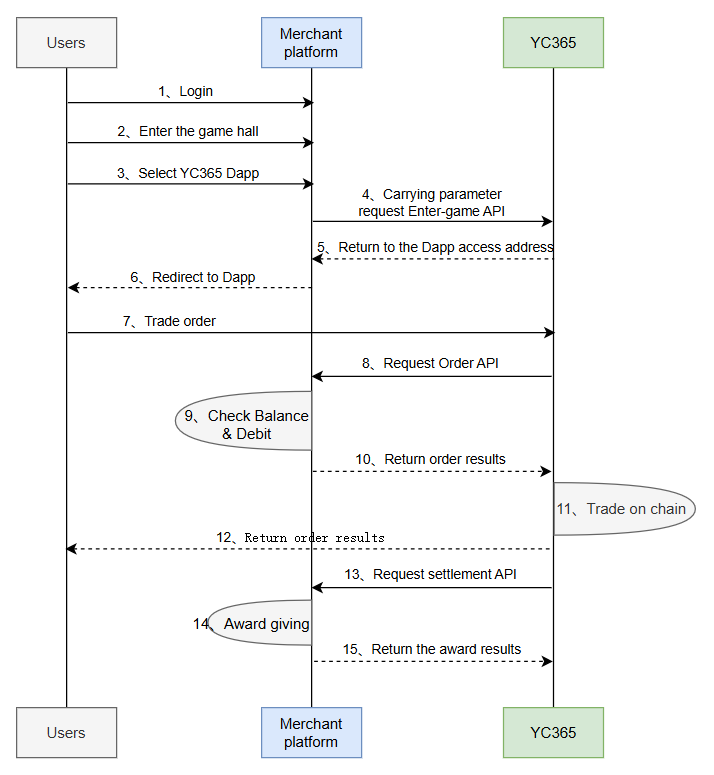
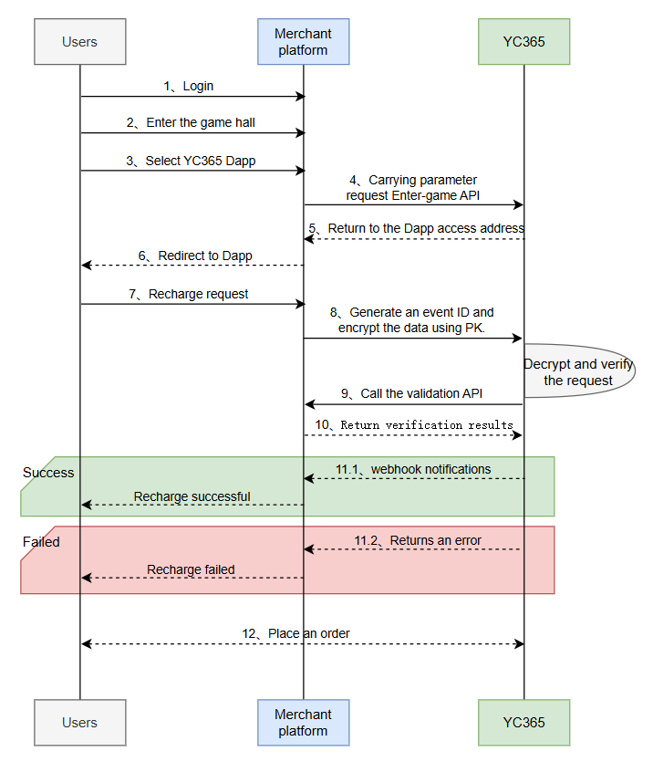

# How to integrate the YC365 Dapp

## Overview

APIs related to the interaction between YC365 Dapp and the merchant platform. Communication interaction supports: no-transfer mode (v1) and transfer mode (v2).

- **Free transfer mode**
  
  users do not need to recharge when entering the Dapp from the merchant platform. When placing an order, the funds are directly deducted from the platform account. The Dapp backend maintains real-time communication with the platform.

  


- **Transfer mode**

  When users enter the Dapp, they need to recharge part of their assets from the platform account to the Dapp account. The Dapp backend remains relatively independent from the platform and does not require real-time communication.

  


## 🎯 Main Functions

1. **Get a Registration Invitation Code**: Obtained offline through communication with a YC365 business representative. One code, one account, for merchant registration.
2. **Merchant Registration**: This API requires manual offline access requests. Merchants or YC365 Business can register by providing the necessary parameters. After registration, merchants will receive important parameters such as app_id, api_key, and wallet_address, which must be kept confidential.
   - Before registration, merchants must prepare the necessary interfaces and confirm whether to use v1 or v2 mode, as different modes require different APIs.
   - The registered app_id and api_key can be stored in the merchant backend. The api_key is used to encrypt communications with the Dapp backend.
   - wallet_address is the merchant's wallet address in the Dapp. Merchants must deposit USDT into this address on the BSC chain.
3. **Get Dapp Access Address**: When a user clicks a text link or icon on the platform page, the platform backend will request this API with the necessary parameters to obtain the Dapp address.
4. **Order Details**: Merchants can view transaction details on the Dapp, facilitating bill verification between the two parties.
5. **Merchant Report**: Merchants can view daily, weekly, and monthly report data.
6. **Daily Summary Data Push**: The Dapp backend will push the previous day's summary data to merchants at midnight UTC.

The data format is as follows:
```json
{
  "event_type": "merchant_overview", // Business event type: daily overview data push
  "data": {
     "app_id":"string",            // Merchant ID
     "balance":0.000000,           // Merchant available USDT
     "frozen":0.000000,            // Merchant frozen USDT
     "period_date":"string",       // First day of the period, e.g., 2025-08-01
     "users":0,                    // Total number of users of the merchant in the Dapp
     "total_deposit":0.000000,     // Total deposit amount, 0 in v1 mode
     "total_deposit_count":0,      // Total number of deposits, 0 in v1 mode
     "total_withdraw":0.000000,    // Total withdrawal amount, 0 in v1 mode
     "total_withdraw_count":0,     // Total withdrawal volume. 0 in v1 mode.
     "total_buy_volume":0.000000,  // Total buy volume
     "total_sell_volume":0.000000, // Total sell volume
     "currency":"string"           // Currency: USDT
  },
  "signature": "xxxxxxxx"
}
```


## 🛡️ Status Code Description

| Status Code | Meaning | Description |
| ------ | ---- | ---- |
| 0 | OK | Request successful |
| 1 | Canceled | Request canceled |
| 2 | Unknown | Unknown service error |
| 3 | InvalidArgument | Invalid argument |
| 7 | PermissionDenied | Signature authentication failed |
| 8 | ResourceExhausted | Current limiting |
| 13 | Internal | Internal service error |


## 💡 **API Interface**

YC365 Dapp provides API for merchant platforms to call

DEV environment domain: http://test.dapp.yc365.io

TEST environment domain: https://dapp.yc365.io

Signature Example:
```go
package main

import (
	"crypto/hmac"
	"crypto/sha256"
	"encoding/hex"
	"encoding/json"
	"fmt"
)

const API_SECRET = "your_api_secret"

type StatisticsReq struct {
	AppId     string `json:"app_id,omitempty=false"`
	Period    string `json:"period,omitempty=false"`
	Date      string `json:"date,omitempty=false"`
	PageSize  uint64 `json:"page_size,omitempty=false"`
	IndexId   uint64 `json:"index_id,omitempty=false"`
}

func main() {
	req := StatisticsReq{
		AppId:    "f80d7941-ae9d-47f4-hj6f-a213f39ej2m4",
		Period:   "weekly",
		Date:     "2025-08-11",
		PageSize: 10,
		IndexId:  0,
	}
	by, _ := json.Marshal(req)
	signMsg, _ := SignMessage(string(by), API_SECRET)
	fmt.Println(signMsg)
}

func SignMessage(message string, key string) (string, error) {
	mac := hmac.New(sha256.New, []byte(key))
	mac.Write([]byte(message))
	return hex.EncodeToString(mac.Sum(nil)), nil
}
```

### 1. Merchants Obtain Invitation Codes

**GET** `/account/v1/app/invitecode`

Obtain invitation codes offline. One code per account. The request header must contain the Authorization header.

**Response**
```json
{
   "code": 0,
   "message": "string",
   "data": "string"    // Invitation code
}
```

### 2. Create a Merchant

**POST** `/account/v1/app/create`

Before creating a merchant, contact your business representative to obtain an invitation code.

**Request Body**
```json
{
   "app_name": "string",         // Merchant name
   "app_desc": "string",         // Merchant description
   "api_version": "string",      // v1 - no-transfer mode, v2 - transfer mode
   "signature_method": "string", // Currently only supports: hmac-sha256
   "assets_api": "string",
   "create_order_api": "string",
   "trade_order_api": "string",
   "cancel_order_api": "string",
   "settlement_api": "string",
   "webhook_api": "string",
   "invite_code": "string" // Invite code
}
```

**Response**
```json
{
    "code": 0,
    "message": "string",
    "data": {
        "app_id": "string",        // Merchant ID
        "api_key": "string",       // API key
        "wallet_address": "string" // Wallet address
    }
}
```

### 3. Get the Dapp access address

**POST** `/account/v1/app/enter-game`

The platform accesses the user's identity and returns the Dapp address, in the form: https://xxx.com?app_id=xx&user_id=xx&user_name=xx&avatar=xx&lang=xx&version=xx&k=xx&t=xx

**Request Body**
```json
{
   "app_id": "string",    // Merchant ID
   "user_id": "string",   // User ID
   "game_id": "string",   // Game ID
   "user_name": "string", // User name
   "avatar": "string",    // User avatar address
   "lang": "string",      // Language type
   "theme": "string",     // Theme style
   "symbol": "string",    // Currency symbol
   "signature": "string"  // Signature method: Combine the above fields into a JSON string in order, then encrypt with HMAC-SHA256.
}
```

**Response**
```json
{
   "code": 0,
   "message": "string",
   "data": "string" // Dapp access address
}
```

### 4. Merchant Assets

**GET** `/account/v1/app/assets`

**Request Parameters**

| Parameter Name | Location | Type | Required | Description |
|------------|--------|--------|-----|------------|
| app_id | query | string | YES | Merchant ID |
|currency| query |string | NO       | default: USDT |
| signature | query | string | YES | Signature |

**Response**
```json
{
   "code": 0,
   "message": "string",
   "data": {
      "balance": "string",  // Available balance, unit: u
      "frozen": "string",   // Frozen amount, unit: u
      "currency": "string", // Currency, USDT
      "app_id": "string"    // Merchant ID
   }
}
```

### 5. Order Details

**GET** `/account/v1/app/order/detail`

Supports querying order details by specified time and user. Data includes deposits, withdrawals, order placements, settlements, and other events.

Event Types:

- **App_Deposit**: Merchant deposit

- **App_Withdraw**: Merchant withdrawal

- **Deposit**: User deposit

- **Withdraw**: User withdrawal

- **Trade_Buy**: Buy order
 
- **Trade_Sell**: Sell order

- **Settlement**: Settlement

- **Unknown**: Unknown

**Request Parameters**

| Parameter Name | Location | Type | Required | Description                                                                |
|------------|--------|--------|----------|----------------------------------------------------------------------------|
|app_id| query| string| YES      | Merchant ID                                                                |
|user_id| query| string| YES      | User ID                                                                    |
|start_time| query| string| NO       | Start time, e.g., 2025-08-01 00:00:00.000                                  |
|end_time| query |string | NO       | End time, such as: 2025-08-01 00:00:00.000                                 |
|index_id| query |integer(int64) | YES      | ID of the last entry on the previous page. 0 is passed for homepage visits |
|page_size| query |integer(int64) | YES      | Number of entries per page, maximum 100                                    |
|currency| query |string | NO       | default: USDT                                                              |
|signature| query |string | YES      | Signature                                                                  |

**Response**
```json
{
   "code": 0,
   "message": "string",
   "data": [
      {
         "id": "string",          // Order ID
         "event_type": "string",  // Event type
         "event_id": "string",    // Event ID
         "amount": "string",      // Amount
         "currency": "string",    // Currency
         "tx_hash": "string",     // Transaction Hash
         "status": "string",      // Status
         "trade": {
            "game_id": "string",      // Game ID
            "condition_id": "string", // Condition ID
            "market_side": 0,         // Market Side
            "amount": "string",       // Transaction Amount
            "price": "string",        // Price
            "side": 0,                // Transaction Side
            "order_id": "string",     // Order ID
            "timestamp": "string"     // Timestamp
        },
        "user_id": "string" // User ID
      }
   ]
}
```

### 6. Merchant Reports

**GET** `/account/v1/app/statistics`

Supports viewing daily, weekly, and monthly report data. Data includes each user's total deposits, withdrawals, buys, sells, deposits, withdrawals, etc.

**Request Parameters**

| Parameter Name | Position | Type | Required | Description |
|------------|--------|--------|---|------------|
|app_id |query| string| YES | Merchant ID|
|period |query| string| YES | Period type: daily/weekly/monthly|
|date |query| string| YES | Date, such as: 2025-08-01|
|page_size |query| integer(int64)| YES | Number of entries per page, maximum 100|
|index_id |query| integer(int64)| YES | Maximum ID value of the previous page, 0 for homepage visits|
|signature |query| string| YES | Signature method: Combine the above fields into a JSON string in order, then encrypt using Curve25519|

**Response**
```json
{
   "code": 0,
   "message": "string",
   "data": [
      {
      "period": "string",         // Cycle type
      "app_id": "string",         // Merchant ID
      "user_id": "string",        // User ID
      "deposit": "string",        // Deposit amount
      "deposit_count": "string",  // Deposit transactions
      "withdraw": "string",       // Withdrawal amount
      "withdraw_count": "string", // Withdrawal transactions
      "index_id": "string",       // Index ID
      "date": "string",           // Date
      "buy_volume": "string",     // Buy volume
      "sell_volume": "string",    // Sell volume
      "currency": "string"        // Currency
      }
   ]
}
```

## 🚀 **APIs that merchant platforms need to provide in V1 mode**

APIs that need to be provided when the merchant platform selects V1 mode

### 1. Get User Balance

**API URL**: `POST /api/yc365/user/balance`

**Description**: YC365 callback to get user balance

**Request Parameters**:
```json
{
    "app_id": "string",    // Application ID, required
    "user_id": "string",   // User authorization code - user ID, required
    "currency": "string",  // Currency type, required
    "signature": "string"  // SHA256 signature of the JSON string composed of the above parameters
}
```

**Response Parameters**:
```json
{
    "code": 0,       // Acceptance status code, enumeration value: 0 - success, 1 - failure
    "msg": "string", // Acceptance description
    "data": {
        "user_id": "string", // User ID
        "balance": 1000.50,  // Balance, in U
        "currency": "USDT"    // Currency Type
    }
}
```

### 2. Create a Trade Order

**API URL**: `POST /api/yc365/trade/create`

**Description**: YC365 Trade Order, Deduct payment when buying direction, no need to handle when selling direction

**Request Parameters**:
```json
{
    "order_id": "string",      // Order ID, required
    "amount": 0.000,           // Total amount, required
    "app_id": "string",        // Application ID, required
    "user_id": "string",       // User ID, required
    "currency": "string",      // Currency Type, required
    "timestamp": 1759119582148,// Timestamp, required
    "side": 0,                 // Buy/Sell Direction, 0 - Sell, 1 - Buy
    "signature": "string"      // SHA256 signature of the above parameters in JSON format
}
```

**Response Parameters**:
```json
{
    "code": 0,        // Acceptance status code, enumeration value: 0 - Success, 1 - Failure
    "msg": "string",  // Acceptance description
    "data": {
        "order_id": "string", // Order ID
        "balance": 1000.50    // Balance, in U
    }
}
```

### 3. Transaction Execution Notification

**API URL**: `POST /api/yc365/trade/execute`

**Description**: Transaction Execution Notification, Don't deal with buying direction, add money when selling direction

**Request Parameters**:
```json
{
    "app_id": "string",         // Application ID, required
    "order_id": "string",       // Order ID, required
    "user_id": "string",        // User ID, required
    "amount": 100.0,            // Transaction amount, required, in U
    "currency": "string",       // Currency type, required
    "timestamp": 1759119582148, // Timestamp, required
    "side": 0,                  // Buy/Sell direction, 0 - Sell, 1 - Buy
    "signature": "string"       // SHA256 signature of the above parameters in JSON format
}
```

**Response Parameters**:
```json
{
    "code": 0,        // Acceptance status code, enumeration value: 0 - Success, 1 - Failure
    "msg": "string",  // Acceptance description
    "data": {
        "order_id": "string", // Order ID
        "currency": "string", // Currency type
        "balance": 1000.50    // Balance
    }
}
```

### 4. Cancel Order

**API URL**: `POST /api/yc365/order/cancel`

**Description**: Cancel Order, Add money when buying direction, do not handle when selling direction

**Request Parameters**:
```json
{
    "app_id": "string",         // Application ID, required
    "order_id": "string",       // Order ID, required
    "user_id": "string",        // User ID, required
    "amount": 100.0,            // Cancellation amount, required, in U
    "currency": "string",       // Currency type, required
    "timestamp": 1759119582148, // Timestamp, required
    "side": 0,                  // Buy/Sell side, 0 - Sell, 1 - Buy
    "signature": "string"       // SHA256 signature of the JSON string composed of the above parameters
}
```

**Response Parameters**:
```json
{
    "code": 0,        // Acceptance status code, enumeration value: 0 - Success, 1 - Failure
    "msg": "string",  // Acceptance description
    "data": {
        "order_id": "string", // Order ID
        "balance": 1000.50,   // Balance
        "currency": "string"  // Currency type
    }
}
```

### 5. Event Settlement and Rewards

**API URL**: `POST /api/yc365/settlement/event`

**Description**: Event Settlement and Rewards, Add money to users

**Request Parameters**:
```json
{
    "app_id": "string",          // Application ID, required
    "user_id": "string",         // User ID, required
    "condition_id": "string",    // Condition ID, required
    "amount": 500.0,             // Winning amount
    "timestamp": 1759119582148,  // Timestamp, required
    "currency": "string",        // Currency type, required
    "signature": "string"        // SHA256 signature of the JSON string composed of the above parameters
}
```

**Response Parameters**:
```json
{
    "code": 0,        // Service acceptance status code, enumeration value: 0 - Success, 1 - Failure
    "msg": "string",  // Acceptance description
    "data": {
        "balance": 1000.50,  // Balance
        "currency": "string" // Currency type
    }
}
```

### 5. Callback Notification

**API URL**: `POST /api/yc365/webhook`

**Description**: YC365 Callback Notification

**Request Parameters**:
```json
{
    "event_type": "string", // Business event type, required. Event types include: Daily push overview data
    "data": "string",       // JSON data, required
    "signature": "string"   // SHA256 signature of the JSON string composed of the above parameters
}
```

**Response Parameters**:
```json
{
    "code": 0,       // Business acceptance status code, enumeration value: 0 - Success, 1 - Failure
    "msg": "string", // Acceptance description
    "data": ""
}
```

